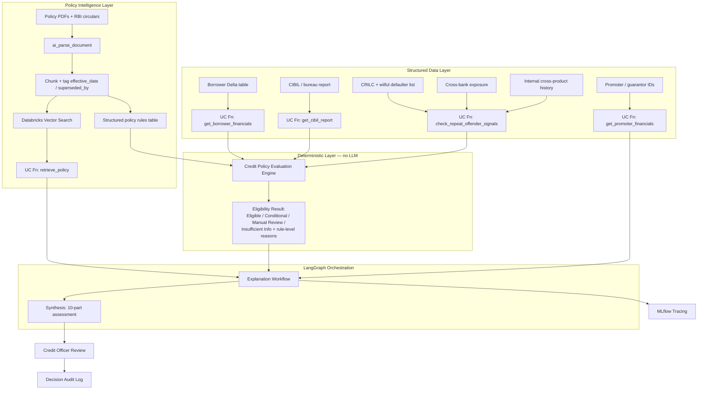
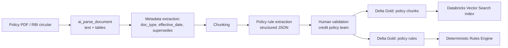
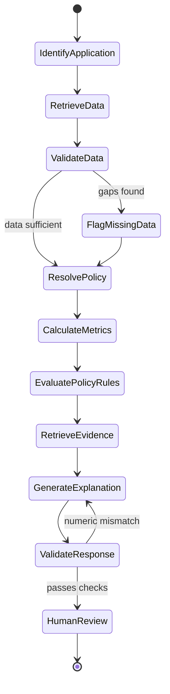

# Credit Decision Support & Policy Intelligence Platform

2026-09-18 · @Someone

## 1. Executive Summary

The **Credit Decision Support & Policy Intelligence Platform** is a Databricks-native credit assessment system built for an SME-focused bank, **Bharat Vikas Bank (BVB)**.

It combines three things a real credit decision needs: validated borrower financials, applicable internal and regulatory policy (correctly versioned by effective date), and a clear separation between *what is calculated* and *what is explained*. A deterministic rules engine evaluates credit metrics against approved policy thresholds; a LangGraph-orchestrated GenAI layer retrieves supporting evidence and explains that result in plain language. The two are deliberately decoupled — the LLM never calculates or decides an outcome, it only explains one already produced by code.

The platform is a **decision-support tool, not an autonomous sanctioning system**: every assessment ends with a credit officer reviewing the evidence and recording the final decision.

### Key business outcome

Give a relationship manager or credit officer a single interface to:

- Pull validated borrower financials and bureau signals
- Identify the policy and regulatory rules that currently apply
- See a deterministic eligibility result with reasons
- See risk factors, exceptions, and missing evidence — not just a yes/no
- Trace every recommendation back to the exact data and policy version used

## 2. Business Problem

An SME credit officer typically cross-references:

1. Borrower financial statements
2. Existing banking exposure and repayment history
3. Credit bureau reports
4. Promoter and guarantor information
5. Collateral documentation
6. Internal credit policy
7. RBI regulatory directions and circulars
8. Sector-specific lending requirements

This creates real, repeated problems: manual cross-referencing across documents, inconsistent policy interpretation between officers, difficulty knowing which policy *version* currently applies, and no reliable way to reproduce how a past assessment was reached.

**Business objective:** build a governed decision-support platform that reduces this manual research burden while keeping the actual eligibility decision deterministic, explainable, and reviewable by a human — not something an LLM decides on its own.

## 3. Reference Business Scenario

**Borrower:** Meera Textiles Pvt Ltd — SME textile exporter, Surat, India **Requested facility:** ₹1.2 crore working-capital loan

| Attribute | Value |
| --- | --- |
| Borrower ID | MT-2026-0142 |
| Sector | Textiles / MSME export |
| Annual turnover | ₹4.8 crore |
| DSCR | 1.15 |
| Days past due | 0 |
| Existing exposure | ₹35 lakh |
| Collateral value | ₹90 lakh |
| Requested loan amount | ₹1.2 crore |

*Values are synthetic, built for demonstration.*

### The narrative hook

Midway through the scenario, RBI tightens the NPA/sector-exposure norms for textile MSME lending via a new circular. The same assessment question — *"Is Meera Textiles eligible for this loan under current policy?"* — is asked twice: once against the old circular, once after the new one is ingested. The deterministic engine's result changes (Eligible → Conditional/Manual Review), and the platform explains *why*, citing the exact circular and effective date.

This single before/after comparison is the centerpiece demo: it proves the platform re-evaluates against current rules automatically, rather than encoding a rule once and going stale.

## 4. High-Level System Architecture



**Key design principle:** the Deterministic Layer calculates and decides; the LangGraph layer only retrieves evidence and explains that decision in language. The LLM never invents a threshold, never overrides `RESULT`, and never hides a missing-data exception.

## 5. Policy Intelligence Pipeline



### Example policy metadata

```json
{
  "document_id": "POLICY-TEXTILE-01",
  "document_type": "rbi_circular",
  "version": "v2",
  "effective_date": "2026-09-01",
  "supersedes": "POLICY-TEXTILE-01-v1",
  "applicable_sector": "textile_msme",
  "approval_status": "approved"
}
```

### Example structured rule

```json
{
  "rule_id": "DSCR-001",
  "metric": "dscr",
  "operator": ">=",
  "threshold": 1.25,
  "applicable_sector": "textile_msme",
  "effective_date": "2026-09-01",
  "source_document_id": "POLICY-TEXTILE-01"
}
```

**Design principle:** the original document text stays the source of truth. The structured rule is a derived, human-validated artifact used only by the deterministic engine — the LLM never extracts or modifies a threshold on its own.

## 6. Credit Assessment Workflow (LangGraph)

A controlled state graph, not an open-ended agent — every step is explicit, and the eligibility calculation happens outside the graph in the deterministic engine.



**Why LangGraph over a free-form agent:** credit decisions need explicit states, a controlled sequence, and a guaranteed human-review exit point. An open-ended tool-calling agent could skip validation or explain a result it invented; a state graph can't reach `HumanReview` without passing through `EvaluatePolicyRules` first.

## 7. Deterministic Credit Policy Evaluation Engine

The engine executes approved policy rules in plain Python/PySpark — no LLM involvement — so the same inputs always produce the same eligibility result.

### Input

```json
{
  "application_id": "APP-001",
  "borrower_id": "MT-2026-0142",
  "product": "working_capital",
  "assessment_date": "2026-09-18",
  "dscr": 1.15,
  "days_past_due": 0,
  "existing_exposure": 3500000,
  "requested_loan_amount": 12000000,
  "collateral_value": 9000000
}
```

### Output

```json
{
  "application_id": "APP-001",
  "policy_version": "v2",
  "eligibility_status": "manual_review",
  "rule_results": [
    {"rule_id": "DSCR-001", "status": "fail", "actual_value": 1.15, "required_value": 1.25}
  ],
  "exceptions": ["DSCR below policy threshold"],
  "missing_information": ["External bureau report"]
}
```

### Division of responsibility

| Rules Engine (deterministic) | LangGraph + LLM |
| --- | --- |
| Loads approved policy rules | Interprets the RM's question |
| Resolves the applicable policy version | Calls approved tools |
| Calculates DSCR, LTV, exposure, etc. | Retrieves supporting evidence |
| Evaluates rule pass/fail | Explains the rule results in plain language |
| Returns a reproducible status | Surfaces risks and missing data |

**The LLM must not:** invent or adjust a threshold, override a rule result, treat missing data as clean, or present an unverified source as authoritative. This separation is what makes the platform's output reproducible — rerunning the same application always returns the same eligibility status.

## 8. Extended Reasoning Layers

Raw eligibility rules aren't the whole picture. These are the additional signals a real credit decision draws on, and where each comes from.

### 8.1 New customer — no internal history

`get_borrower_financials` returns an explicit `no_internal_history` flag rather than a silent empty result. Fallback evidence: bureau report, 6–12 months of bank statements (Account Aggregator consent), ITR/GST filings. A separate "new-to-bank" policy track applies (lower ticket size, mandatory collateral or co-obligant) — its own chunk in the policy corpus, retrieved instead of the existing-relationship rule set.

### 8.2 Repeat offender / habitual delinquency

- **Internal:** `get_internal_relationship_history` aggregates across the bank's own product tables (cards, overdrafts, other loans) by customer ID — a missed payment elsewhere at BVB should surface here.
- **External:** **CRILC** (RBI's large-exposure repository) and the **RBI/IBA wilful defaulter list** are the standard industry references for cross-lender default behavior.
- A hit here weighs heavily in Key Risk Factors regardless of how clean the current application looks.

### 8.3 Cross-bank exposure history

CRILC (₹5 Cr+ exposures) and bureau consortium data (CIBIL/Experian/Equifax/CRIF) are the real sources; for this platform they're represented as a `cross_bank_exposure` field seeded from a synthetic table, so the reasoning pattern — the agent checks it and weighs it — is demonstrable without a live regulatory feed.

### 8.4 Promoter / guarantor checks

For a company borrower, the company's financials alone aren't the full picture. `get_borrower_financials` accepts an optional `owner_ids[]` and returns a promoter-risk sub-object: individual CIBIL, other business interests with exposure at BVB or elsewhere, and guarantor checks where a personal guarantee backs the loan.

### 8.5 CIBIL integration

The connective layer for most of the above. `get_cibil_report(pan)` wraps the bureau lookup; production use would need DPDP-Act-compliant consent logging and encryption. CIBIL score, active accounts, delinquency flags, and enquiry count are treated as required inputs for every assessment — not an optional add-on — matching how a real credit officer works.

## 9. Assessment Output Format

Every query returns a structured, audit-ready record:

1. **Assessment Summary** — one-line verdict
2. **Borrower Facts** — borrower ID, application ID, financial metrics, data freshness
3. **Credit Metrics** — DSCR, exposure, requested amount, collateral, each with its source
4. **Policy Evaluation** — rule-by-rule pass/fail from the deterministic engine, not the LLM
5. **Key Risk Factors** — grounded in validated data and rule results
6. **Mitigating Factors**
7. **Missing Information** — evidence that's unavailable, stale, or unverified — never hidden or treated as clean
8. **Policy and Regulatory Basis** — document, version, effective date, clause cited
9. **Assessment Outcome** — Eligible / Ineligible / Conditional / Manual Review / Insufficient Information
10. **Human Review** — reviewer, comments, final decision, override reason if applicable

### Demo output — before the circular update

> **Outcome:** Eligible (standard terms) **Policy Basis:** RBI Textile Sector Circular, effective 2026-01-01

### Demo output — after the circular update (same question)

> **Outcome:** Conditional — additional collateral required **Policy Basis:** RBI Textile Sector Circular (Revised), effective 2026-09-01, supersedes prior version

The deterministic engine produced both outcomes; the LangGraph layer only explains each, citing the correct circular version.

## 10. Technology Stack

| Component | Technology |
| --- | --- |
| Structured data | Delta Lake |
| Governance | Unity Catalog |
| Document parsing | `ai_parse_document` |
| Ingestion | Delta Live Tables |
| Retrieval | Databricks Vector Search (metadata-filtered) |
| Rules engine | Python / PySpark, deterministic |
| Agent orchestration | LangGraph + LangChain tools |
| Observability | MLflow Tracing |
| Serving | FastAPI / Databricks Model Serving |
| Platform | Databricks Free Edition |

## 11. Evaluation Framework

| Layer | Metrics |
| --- | --- |
| Retrieval | Recall@K, precision@K, policy-version accuracy, effective-date accuracy |
| Rules engine | Calculation accuracy, rule-evaluation accuracy, agreement with golden cases |
| GenAI explanation | Faithfulness, groundedness, citation correctness, unsupported-claim rate |
| Agent (LangGraph) | Tool-selection accuracy, correct arguments, workflow completion rate |

### Golden test set

1. Healthy borrower
2. Borderline (SMA-1) borrower
3. NPA / delinquency case
4. New-to-bank borrower (no internal history)
5. Missing bureau report
6. Superseded policy still being cited
7. Future-effective policy not yet applicable
8. Repeat offender flagged via CRILC/internal history
9. Promoter with existing exposure elsewhere
10. Pre/post circular-update comparison (the centerpiece case)

Each case has a deterministic expected outcome, so pass/fail is objective, not subjective.

## 12. Platform Positioning

### What this platform demonstrates

- A real separation between deterministic decisioning and LLM-generated explanation — the architectural choice that makes the output reproducible and auditable
- Effective-dated regulatory versioning, proven live via the pre/post-circular demo
- A controlled LangGraph workflow with an explicit human-review gate, not an open-ended agent
- Multi-signal reasoning across structured financials, bureau data, cross-bank exposure, and promoter checks — not single-document RAG
- Full observability via MLflow tracing, with a golden test set for regression

### Where the platform grows from here

This build represents the core reasoning architecture end to end, using synthetic and mocked data for external integrations (CIBIL, CRILC, cross-bank exposure). The natural next steps for a bank rollout:

- Swap synthetic bureau/CRILC data for live commercial API integrations, with DPDP-Act consent logging
- Connect the borrower Delta table to the bank's core banking system instead of a seeded dataset
- Move policy ingestion onto a scheduled pipeline that watches for new RBI circulars automatically
- Add role-based access control and a formal approval workflow for changes to policy rule thresholds
- Extend the credit officer review screen into a full case-management UI

These are natural extensions of the same architecture, not gaps in it — the reasoning layer, the deterministic/LLM split, and the audit trail are already designed to support them.

## 13. Build Roadmap

| Phase | Deliverable |
| --- | --- |
| 1 — Foundation | Databricks workspace, Unity Catalog, synthetic borrower + CIBIL + CRILC tables |
| 2 — Policy intelligence | Circular ingestion via `ai_parse_document`, effective-dated chunking, Vector Search, structured rules table |
| 3 — Deterministic engine | Python rules engine, metric calculations, golden test cases |
| 4 — Agent layer | LangGraph state workflow, LangChain tools, synthesis prompt, response validation |
| 5 — Demo + observability | Pre/post-circular comparison, MLflow tracing, optional FastAPI serving layer |
