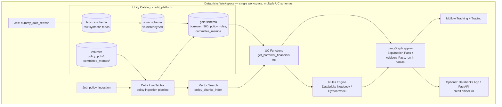
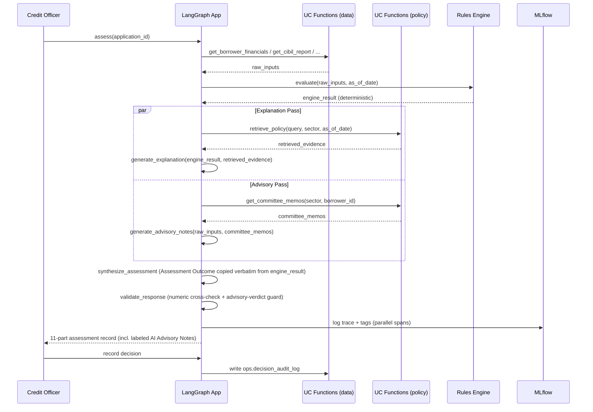

# Phased Implementation Plan & Low-Level Design
### Credit Decision Support & Policy Intelligence Platform — Databricks, Dummy Data

Companion to `Credit Decision Support & Policy Intelligence Platform.md` (business case + HLD). This document turns Section 13's roadmap into an executable, phase-by-phase build plan and adds the Low-Level Design that file stops short of.

**Ground rules for this build:**
1. **Databricks only** — Unity Catalog, Delta Lake, Vector Search, Model Serving, Jobs/DLT, MLflow. No external infra.
2. **Dummy data only** — every borrower, bureau, CRILC, and promoter record is synthetically generated. No real PII, no live API calls.
3. Architecture is designed once, at both HLD and LLD, before Phase 1 starts — phases implement against a fixed contract, not an evolving one.

---

## Part A — High-Level Architecture (recap + system boundary)

The HLD flow (data → policy intelligence → deterministic engine → LangGraph explanation → human review) is already defined in the main doc, Section 4. The one addition here is the **system boundary / deployment view**, which the main doc doesn't cover:



Everything lives inside one Databricks workspace and one Unity Catalog catalog (`credit_platform`). This keeps the project runnable on **Databricks Free Edition** with zero external dependencies — the constraint the original doc's tech stack (Section 10) already commits to.

---

## Part B — Phased Implementation Plan

Each phase has a fixed goal, dummy-data scope, deliverables, and an **exit criterion** — a concrete, testable condition that must be true before the next phase starts. Durations assume a solo/learning pace (part-time), not a team sprint.

### Phase 0 — Workspace & Repo Bootstrap (1–2 days)

| | |
|---|---|
| **Goal** | Databricks environment and repo scaffold exist and are reproducible from scratch |
| **Tasks** | Create Databricks Free Edition workspace; create catalog `credit_platform` with schemas `bronze`, `silver`, `gold`, `policy`, `ops`; create a Volume `credit_platform.policy.policy_pdfs`; set up Databricks Repos linked to a git repo with the folder structure in Part C; configure a personal cluster policy / serverless SQL warehouse |
| **Dummy data** | None yet — infra only |
| **Deliverable** | Empty but structured UC catalog; repo with folder skeleton; a "hello world" notebook that reads/writes one Delta table |
| **Exit criterion** | `SELECT * FROM credit_platform.bronze.<test_table>` runs from a notebook and from a SQL warehouse |

### Phase 1 — Foundation: Synthetic Data Layer (3–5 days)

Maps to Section 13, Phase 1 — expanded.

| | |
|---|---|
| **Goal** | All structured "ground truth" data the rules engine and agent will query exists as governed Delta tables |
| **Tasks** | Write a generator notebook (`data_generation/00_generate_dummy_data.py`) producing: borrowers, financial statements, CIBIL reports, CRILC/wilful-defaulter records, cross-bank exposure, promoter/guarantor records, internal product history (cards/OD/loans); load as bronze → validate/type → silver; build `gold.borrower_360` and seed `gold.applications` with the reference application; register the 4 UC Functions in a second notebook (`data_generation/01_register_uc_functions.py`) per the LLD table/function schemas in Part D. Both notebooks run as tasks in one bundle job (`resources/jobs.yml`), deployed and run against both `credit_platform` (dev) and `credit_platform_prod` (prod), matching Phase 0's pattern |
| **Dummy data scope** | ~200 synthetic borrowers, weighted so ~70% "clean," ~15% borderline (SMA-1-like), ~10% delinquent/NPA, ~5% flagged repeat-offender; include the fixed reference borrower **Meera Textiles (MT-2026-0142)** exactly as specified in Section 3, so the demo scenario is reproducible on top of the random pool. Generation uses a fixed random seed so both environments end up with the identical synthetic pool |
| **Deliverable** | Populated `bronze`/`silver`/`gold` schemas in both catalogs; 4 working UC Functions callable from SQL and Python; a data dictionary (Part D.2) |
| **Exit criterion** | Given `MT-2026-0142`, `get_borrower_financials()` returns the exact values in Section 3's reference table |

### Phase 2 — Policy Intelligence Pipeline (4–6 days)

Maps to Section 13, Phase 2.

| | |
|---|---|
| **Goal** | Policy documents are parsed, versioned by effective date, chunked, embedded, and also distilled into a structured, machine-evaluable rules table; a separate qualitative corpus (committee memos) is parsed and made available to the new Advisory Pass |
| **Tasks** | `data_generation/02_generate_policy_documents.py`: generate 4 dummy policy PDFs (general SME policy, textile circular v1, textile circular v2 revised, pharma sector policy as a negative-retrieval control) with `reportlab`, upload to the `policy_pdfs` Volume, write their manifest to `bronze.raw_policy_documents`, and seed `gold.policy_rules` directly from the same authored ground truth (see note below); also generate 7 committee memo PDFs, upload to `committee_memos/`, manifest to `bronze.raw_committee_memo_manifest`. `pipelines/policy_ingestion.py`: parse every PDF with `ai_parse_document`, chunk policy docs into `gold.policy_chunks` (one chunk per parsed title/paragraph element) and memos into `gold.committee_memos` (one row per memo, no chunking), then create/sync a Vector Search Delta Sync index over `policy_chunks`. UC Functions `retrieve_policy` and `get_committee_memos` are registered in a follow-up notebook once the index is queryable. **Simplification, stated plainly:** `gold.policy_rules` is authored directly alongside the PDF text rather than produced by a separate AI extraction step — for synthetic ground truth we already know exactly, running an LLM to re-extract what we just wrote would add fragility without adding fidelity. `ai_parse_document` is genuinely used for the unstructured text → chunks path, which is the part of Section 5's pipeline this project actually needs to demonstrate. |
| **Real constraint hit and worked around** | Spark's `binaryFile` datasource / `read_files` table-valued function cannot see Unity Catalog Volume files on this workspace's serverless job compute — `spark.read.format("binaryFile").load("/Volumes/...")` returns 0 rows even though `dbutils.fs.ls` and plain Python `open()` on the identical path both work. `policy_ingestion.py` reads each file with `open(path, "rb")` and hands the bytes to `ai_parse_document` via a one-row DataFrame instead of bulk-loading the volume. Also: this project needed its own Vector Search endpoints (`credit_platform_dev`, `credit_platform_prod`) rather than reusing a pre-existing unrelated one already in the workspace. |
| **Dummy data scope** | The pre/post-circular pair is mandatory: `POLICY-TEXTILE-01` (v1, effective 2026-01-01) and `POLICY-TEXTILE-01-v2` (effective 2026-09-01, supersedes v1, raises DSCR threshold) — this pair is what makes the Section 3 narrative hook work. For memos: at least one memo dated pre-circular with no qualitative concerns, and one dated post-circular noting softening sector export volumes — mirroring the two demo outputs in Section 9 |
| **Deliverable** | Working `retrieve_policy(query, sector, as_of_date)` that returns only the version effective as of `as_of_date`; `policy_rules` table with the DSCR-001-style structured rules; working `get_committee_memos(sector, borrower_id)` returning memo text + date |
| **Exit criterion** | `retrieve_policy("DSCR threshold textile", as_of="2026-08-01")` returns v1; same call with `as_of="2026-09-15"` returns v2, and never both. `get_committee_memos("textile_msme")` returns the seeded memos, most recent first |

### Phase 3 — Deterministic Rules Engine (3–5 days)

Maps to Section 13, Phase 3.

| | |
|---|---|
| **Goal** | A pure Python/PySpark engine that takes an application + resolved policy version and deterministically returns eligibility — no LLM in this phase at all |
| **Tasks** | `engine/rule_loader.py`, `metric_calculator.py`, `policy_evaluator.py`, `result_builder.py`: plain Python, zero Spark/Databricks dependency (see LLD Part D.4) — a deliberate design choice that let all 10 golden cases run and pass as local `unittest` tests (`engine/tests/test_golden_cases.py`, `python3 -m unittest engine.tests.test_golden_cases`) with no Databricks round-trip at all. `pipelines/run_assessment.py`: a thin Databricks-side adapter that fetches a real application from `gold.applications`, a borrower via the Phase-1 `get_borrower_financials`/`check_repeat_offender_signals` UC Functions, and rules from `gold.policy_rules` joined to `bronze.raw_policy_documents.version`, feeds them to the same pure engine, and appends the result to `ops.assessment_results` — proving the engine also works end-to-end against live data, not just in isolation |
| **Dummy data scope** | The 10 golden cases are synthetic dicts constructed directly in the test file (no catalog dependency for correctness) — reusing Meera Textiles' exact Section 3 values only for case 10, the pre/post-circular centerpiece. The live-data wiring (`run_assessment.py`) reuses Phase 1/2's already-seeded `APP-001` |
| **Deliverable** | `engine/` as an importable, dependency-free Python package producing the exact JSON output shape in Section 7; all 10 golden cases + a dedicated determinism test (same input, 5 repeated calls, byte-identical output) passing locally; `ops.assessment_results` populated with a real, byte-for-byte match to Section 7's documented example for `APP-001` in both dev and prod |
| **Exit criterion** | All 10 golden cases pass with a **deterministic, reproducible** status (same input → same output across repeated runs) |

### Phase 4 — Agent / Orchestration Layer (4–6 days)

Maps to Section 13, Phase 4.

| | |
|---|---|
| **Goal** | LangGraph state workflow with two parallel passes off `EvaluatePolicyRules`: an **Explanation Pass** that grounds `RESULT` in evidence, and an **Advisory Pass** that reasons independently over full context — neither recalculates or overrides `RESULT` |
| **Tasks** | Implement the state graph from Section 6 as LangGraph nodes, including the `RunAdvisoryPass → GenerateAdvisoryNotes` branch and the `SynthesizeAssessment` join; wrap each UC Function (including the new `get_committee_memos`) as a LangChain tool; write the Explanation synthesis prompt and a separate Advisory prompt producing the 11-part output (Section 9); implement `ValidateResponse` as a numeric cross-check on the Explanation Pass only (every number must match a value already present in `RESULT` or retrieved evidence — reject and loop back to `GenerateExplanation` on mismatch); enforce in the Advisory prompt/parser that its output is written only to the `AI Advisory Notes` field and never to `Assessment Outcome` |
| **Dummy data scope** | No new data — this phase consumes Phase 1–3 outputs plus Phase 2's `committee_memos` |
| **Deliverable** | Running graph, invocable end-to-end with just `application_id`; produces the full 11-part assessment record with Advisory Notes clearly labeled and separated from the deterministic outcome |
| **Exit criterion** | For MT-2026-0142, the Explanation Pass's `Assessment Outcome` and `Key Risk Factors` cite only numbers traceable to `RESULT` or a retrieved policy chunk — zero invented figures across 10 sample runs; the Advisory Pass's output never contains an eligibility verdict (`Eligible`/`Conditional`/etc.) and `Assessment Outcome` is byte-identical to `RESULT.eligibility_status` regardless of what the Advisory Pass wrote |

### Phase 5 — Demo, Evaluation & Observability (3–4 days)

Maps to Section 13, Phase 5.

| | |
|---|---|
| **Goal** | The pre/post-circular demo runs live, everything is traced, and the golden set has a pass/fail report |
| **Tasks** | Wire MLflow Tracing across every LangGraph node and the rules engine call; build the pre/post-circular demo notebook (same question, run before and after ingesting policy v2); run the full golden set through the agent (not just the engine) and record retrieval/faithfulness/groundedness metrics per Section 11; optionally stand up a thin FastAPI or Databricks App front-end for the credit officer review step |
| **Dummy data scope** | None new |
| **Deliverable** | MLflow experiment with traced runs; a recorded before/after comparison matching Section 9's two demo outputs, including the differing Advisory Notes for each run; an evaluation report against Section 11's metrics table |
| **Exit criterion** | Demo notebook reproduces Section 9's exact before/after outcome change (`Eligible` → `Conditional`) end-to-end without manual intervention, and the two runs' Advisory Notes differ (no-concern memo vs. softening-sector memo) while the eligibility outcome logic is driven solely by the rules engine |

### Phase 6 — Hardening & Stretch (optional, open-ended)

Only pursue after Phase 5 is solid. Candidates, in priority order: role-based access control on `policy_rules` writes, a real case-management UI, scheduled circular-watching job, human-in-the-loop override logging into `ops.decision_audit_log`. These map directly to Section 12's "Where the platform grows from here" — treat them as backlog, not a committed phase.

---

## Part C — Repository Layout (LLD)

```
RAG-Project/
├── Credit Decision Support & Policy Intelligence Platform.md   # business case + HLD (existing)
├── Phased Implementation Plan & LLD.md                          # this file
├── data_generation/
│   ├── 00_generate_dummy_data.py           # synthetic bronze -> silver -> gold data
│   ├── 01_register_uc_functions.py        # registers the 4 Phase-1 UC Functions
│   ├── 02_generate_policy_documents.py    # authors + uploads policy/memo PDFs, seeds policy_rules
│   └── 03_register_policy_functions.py    # registers retrieve_policy + get_committee_memos
├── pipelines/
│   ├── policy_ingestion.py              # ai_parse_document -> chunk -> gold.policy_chunks/committee_memos + VS index
│   ├── run_assessment.py                # wires engine/ to live catalog data, writes ops.assessment_results
│   └── data_refresh_job.py              # scheduled bronze->silver->gold refresh
├── engine/                               # pure Python, no Spark/Databricks dependency
│   ├── rule_loader.py
│   ├── metric_calculator.py
│   ├── policy_evaluator.py
│   ├── result_builder.py
│   └── tests/test_golden_cases.py       # `python3 -m unittest engine.tests.test_golden_cases`
├── agent/
│   ├── state.py                         # LangGraph state schema
│   ├── nodes.py                         # one function per state in Section 6
│   ├── tools.py                         # LangChain wrappers over UC Functions
│   ├── graph.py                         # graph assembly
│   └── prompts/
│       ├── explanation_prompt.md
│       └── advisory_prompt.md
├── serving/
│   └── app.py                           # optional FastAPI / Databricks App
└── notebooks/
    ├── 01_setup_unity_catalog.py
    ├── 02_demo_pre_post_circular.py
    └── 03_run_golden_set_eval.py
```

---

## Part D — Low-Level Design

### D.1 Unity Catalog structure

```
credit_platform (catalog)
├── bronze
│   ├── raw_borrowers
│   ├── raw_financial_statements
│   ├── raw_cibil_reports
│   ├── raw_crilc_records
│   ├── raw_internal_product_history
│   └── raw_promoter_records
├── silver
│   ├── borrowers
│   ├── financial_statements
│   ├── cibil_reports
│   ├── crilc_records
│   ├── internal_product_history
│   └── promoter_records
├── gold
│   ├── borrower_360            (wide table, one row per borrower_id)
│   ├── policy_chunks           (text + metadata, source for vector index)
│   ├── policy_rules            (structured, source for rules engine)
│   ├── committee_memos         (qualitative text, source for Advisory Pass only)
│   └── applications
├── policy
│   └── (Volume) policy_pdfs/{document_id}/{version}.pdf, committee_memos/{memo_id}.pdf
└── ops
    ├── assessment_results      (engine output, append-only)
    ├── assessment_explanations (agent output, append-only)
    └── decision_audit_log      (human review + overrides)
```

### D.2 Core table schemas

#### Phase 1 source schemas (bronze → silver, identical shape; silver adds PK dedupe + not-null filtering)

All monetary columns are `DOUBLE` in the actual implementation (not `DECIMAL`) — simpler to generate and join in PySpark for a synthetic-data project; revisit only if real currency-precision requirements appear later.

**`bronze.raw_borrowers` → `silver.borrowers`** (PK: `borrower_id`)

| Column | Type |
|---|---|
| borrower_id | STRING |
| legal_name | STRING |
| sector | STRING |
| annual_turnover | DOUBLE |
| pan | STRING — company PAN, joins to `cibil_reports.pan` for the business bureau report |
| city | STRING |
| owner_ids | ARRAY<STRING> |
| no_internal_history | BOOLEAN |
| relationship_start_date | DATE |

**`bronze.raw_financial_statements` → `silver.financial_statements`** (PK: `borrower_id`, `statement_date`)

| Column | Type |
|---|---|
| borrower_id | STRING |
| statement_date | DATE |
| dscr | DOUBLE |
| days_past_due | INT |
| existing_exposure | DOUBLE |
| collateral_value | DOUBLE |

**`bronze.raw_cibil_reports` → `silver.cibil_reports`** (PK: `pan`)

| Column | Type |
|---|---|
| pan | STRING |
| borrower_id | STRING |
| cibil_score | INT |
| active_accounts | INT |
| delinquency_flag | BOOLEAN |
| enquiry_count | INT |
| report_date | DATE |

**`bronze.raw_crilc_records` → `silver.crilc_records`** (PK: `borrower_id`)

| Column | Type |
|---|---|
| borrower_id | STRING |
| crilc_flag | BOOLEAN |
| wilful_defaulter_flag | BOOLEAN |
| cross_bank_exposure | DOUBLE |
| reporting_date | DATE |

**`bronze.raw_internal_product_history` → `silver.internal_product_history`** (PK: `borrower_id`, `product_type`, `product_open_date`)

| Column | Type |
|---|---|
| borrower_id | STRING |
| product_type | STRING — `credit_card` / `overdraft` / `term_loan` |
| missed_payment_flag | BOOLEAN |
| days_past_due | INT |
| product_open_date | DATE |

**`bronze.raw_promoter_records` → `silver.promoter_records`** (PK: `owner_id`)

| Column | Type |
|---|---|
| owner_id | STRING |
| borrower_id | STRING |
| name | STRING |
| pan | STRING |
| individual_cibil_score | INT |
| other_business_interests | STRING — free text, empty when none |
| guarantor_flag | BOOLEAN |
| exposure_elsewhere | DOUBLE |

**`gold.borrower_360`** — built by joining the six silver tables above on `borrower_id` (and `pan` for the CIBIL join)

| Column | Type | Notes |
|---|---|---|
| borrower_id | STRING (PK) | e.g. `MT-2026-0142` |
| legal_name | STRING | |
| sector | STRING | e.g. `textile_msme` |
| annual_turnover | DOUBLE | |
| dscr | DOUBLE | latest computed DSCR |
| days_past_due | INT | |
| existing_exposure | DOUBLE | |
| collateral_value | DOUBLE | |
| cibil_score | INT | nullable → drives `missing_information` |
| crilc_flag | BOOLEAN | |
| wilful_defaulter_flag | BOOLEAN | |
| no_internal_history | BOOLEAN | true for new-to-bank borrowers (Section 8.1) |
| owner_ids | ARRAY<STRING> | promoter/guarantor IDs |
| data_as_of | DATE | freshness field surfaced in output Section 9.2 |

**`gold.applications`** (PK: `application_id`) — seeded in Phase 1 with the single reference application `APP-001` (Section 7); more rows arrive with Phase 3's golden test set

| Column | Type |
|---|---|
| application_id | STRING |
| borrower_id | STRING |
| product | STRING |
| assessment_date | DATE |
| requested_loan_amount | DOUBLE |

**`gold.policy_rules`** — same fields as Section 5's example, with one addition made during implementation: `rule_id` (e.g. `DSCR-001`) repeats across policy versions and even across sectors (the pharma negative-control document also defines its own `DSCR-001` at a different threshold), so it can't be the table's primary key on its own. `rule_uid` is the actual PK; `rule_id` stays the stable, version-independent label the rules engine (Phase 3) returns in its output, matching Section 7 exactly.

| Column | Type |
|---|---|
| rule_uid | STRING (PK) — e.g. `POLICY-TEXTILE-01-v2-DSCR-001` |
| rule_id | STRING — e.g. `DSCR-001`, stable across versions |
| metric | STRING |
| operator | STRING |
| threshold | DOUBLE |
| applicable_sector | STRING |
| effective_date | DATE |
| supersedes | STRING NULL |
| source_document_id | STRING |
| approval_status | STRING |

**`gold.policy_chunks`** (Vector Search source table)

| Column | Type |
|---|---|
| chunk_id | STRING (PK) |
| document_id | STRING |
| version | STRING |
| chunk_text | STRING |
| effective_date | DATE |
| supersedes | STRING NULL |
| applicable_sector | STRING |
| embedding | ARRAY<FLOAT> (managed by Vector Search) |

**`gold.committee_memos`** (Advisory Pass source — no vector index, read directly by tool call)

| Column | Type | Notes |
|---|---|---|
| memo_id | STRING (PK) | |
| applicable_sector | STRING | e.g. `textile_msme` |
| borrower_id | STRING NULL | set when a memo names a specific borrower |
| memo_date | DATE | used for "most recent first" ordering |
| memo_text | STRING | parsed, human-readable qualitative note |
| source_document_id | STRING | |

**`ops.assessment_results`** (implemented in Phase 3) and **`ops.assessment_explanations`** (Phase 4) persist the exact JSON shapes from Section 7 (engine) and Section 9 (agent) respectively, keyed by `application_id`, append-only, so re-running an old `application_id` never overwrites history — this is what makes the audit trail in Section 1 real rather than aspirational.

**`ops.assessment_results`** — one row per engine run:

| Column | Type |
|---|---|
| application_id | STRING |
| policy_version | STRING |
| eligibility_status | STRING |
| rule_results | ARRAY<STRUCT<rule_id: STRING, metric: STRING, operator: STRING, status: STRING, actual_value: DOUBLE, required_value: DOUBLE>> |
| exceptions | ARRAY<STRING> |
| missing_information | ARRAY<STRING> |
| assessed_at | TIMESTAMP |

### D.3 UC Functions (contract between data layer and both the engine and the agent)

| Function | Signature | Backing table(s) |
|---|---|---|
| `get_borrower_financials` | `(borrower_id STRING, owner_ids ARRAY<STRING> DEFAULT NULL) -> STRUCT` | `gold.borrower_360` |
| `get_cibil_report` | `(pan STRING) -> STRUCT` | `silver.cibil_reports` |
| `check_repeat_offender_signals` | `(borrower_id STRING) -> STRUCT` | `silver.crilc_records`, `silver.internal_product_history` |
| `get_promoter_financials` | `(owner_ids ARRAY<STRING>) -> ARRAY<STRUCT>` | `silver.promoter_records` |
| `retrieve_policy` | `(query STRING, applicable_sector STRING, as_of_date DATE) -> ARRAY<STRUCT>` | `gold.policy_chunks` via Vector Search index, filtered by `effective_date <= as_of_date` and no non-null `supersedes` pointing forward |
| `get_committee_memos` | `(applicable_sector STRING, borrower_id STRING DEFAULT NULL) -> ARRAY<STRUCT>` | `gold.committee_memos`, ordered by `memo_date DESC`; **called only by the Advisory Pass**, never by the Explanation Pass or the rules engine |

All six are registered as Unity Catalog Functions so they are callable identically from SQL, from the rules engine (Python), and as LangChain tools in the agent — one implementation, multiple callers. `get_committee_memos` is the one function the Explanation Pass and rules engine are never wired to call — that restriction is what keeps qualitative memo content out of the authoritative `RESULT` and `Assessment Outcome` fields.

**Implementation note on `retrieve_policy`:** the `VECTOR_SEARCH` SQL table function on this workspace accepts only `index`, `query`/`query_text`, and `num_results` — passing a `filters` argument fails with `UNRECOGNIZED_PARAMETER_NAME` (confirmed by calling it directly). So `retrieve_policy` requests a wide candidate set (`num_results => 20`) unfiltered, then applies sector, effective-date, and non-superseded-document filtering in the wrapping SQL rather than pushing it into the vector search call itself. Verified live: querying "DSCR threshold textile" with `as_of_date` before 2026-09-01 returns only `POLICY-TEXTILE-01` (v1); the identical query with a date after that returns only `POLICY-TEXTILE-01-v2` — the pre/post-circular switch this whole design exists to demonstrate.

### D.4 Deterministic Rules Engine — module design

```python
# engine/rule_loader.py — takes plain dicts, never touches Spark or the catalog itself
select_applicable_rules(all_rules, applicable_sector, as_of_date) -> list[dict]
resolve_headline_version(applicable_rules, applicable_sector) -> str

# engine/metric_calculator.py
compute_metrics(application, borrower) -> dict            # dscr, days_past_due, collateral_coverage_ratio

# engine/policy_evaluator.py
evaluate_rules(metrics, rules) -> list[dict]               # {rule_id, metric, operator, status, actual_value, required_value}

# engine/result_builder.py
build_result(application, rule_results, policy_version, missing_fields=None, hard_block=False, exceptions=None) -> dict  # Section 7 JSON shape
```

Pure functions throughout — no network calls, no LLM calls, no randomness, and (implemented, not just aspired to) **no Spark dependency either**: every module takes and returns plain Python dicts/lists, so the entire golden test suite runs as ordinary `unittest` locally in under a second, with zero Databricks round-trips. `select_applicable_rules` is the *only* place `as_of_date`/supersession resolution logic lives — both the "which document version applies" question (Section 3's narrative hook) and the "future-effective rule not yet applicable" question (golden case 7) collapse to one function, unit-tested in isolation.

`gold.policy_rules` doesn't carry a `version` column (that lives on `bronze.raw_policy_documents`) — the Databricks-side caller (`pipelines/run_assessment.py`) joins the two before handing rows to `select_applicable_rules`, so the engine itself never needs to know where `version` came from.

**Eligibility-status precedence (the one piece of domain logic `result_builder.py` owns):** missing/unavailable required metric → `insufficient_information`; `hard_block=True` (wilful-defaulter signal from `check_repeat_offender_signals`) → `ineligible`, overriding every other metric; a failed `dscr` or `days_past_due` rule → `manual_review`; a failed `collateral_coverage_ratio` rule → `conditional`; otherwise → `eligible`. A bare CRILC flag (repeat-offender signal short of wilful-defaulter) deliberately does **not** change this status on its own — Section 8.2 treats it as a Key Risk Factor for the human reviewer and the Explanation/Advisory passes to weigh, not grounds for automatic engine-level rejection.

### D.5 LangGraph — state schema and node map

```python
class AssessmentState(TypedDict):
    application_id: str
    borrower_id: str
    raw_inputs: dict           # from UC Functions
    missing_fields: list[str]
    engine_result: dict        # Section 7 output — set once, never mutated after
    retrieved_evidence: list[dict]
    draft_explanation: str
    committee_memos: list[dict]     # from get_committee_memos, Advisory Pass only
    advisory_notes: str              # Advisory Pass output — never eligibility-bearing
    validation_errors: list[str]
    final_assessment: dict     # Section 9's 11-part record
```

Node-to-state-diagram mapping (Section 6 is authoritative for the flow; this is the implementation mapping). The graph forks into two branches after `evaluate_policy_rules` and rejoins at `synthesize_assessment`:

| Node function | Reads | Writes | Notes |
|---|---|---|---|
| `identify_application` | `application_id` | `borrower_id` | lookup only |
| `retrieve_data` | `borrower_id` | `raw_inputs` | calls the 4 data UC Functions as tools |
| `validate_data` | `raw_inputs` | `missing_fields` | no tool calls, pure check |
| `flag_missing_data` | `missing_fields` | `raw_inputs` (annotated) | never fabricates a value |
| `resolve_policy` + `calculate_metrics` + `evaluate_policy_rules` | `raw_inputs` | `engine_result` | **calls the Phase-3 engine directly — not an LLM call** |
| *Explanation branch:* `retrieve_evidence` | `engine_result`, `borrower_id` | `retrieved_evidence` | calls `retrieve_policy` tool |
| *Explanation branch:* `generate_explanation` | `engine_result`, `retrieved_evidence` | `draft_explanation` | LLM-generation step; grounded, restates `RESULT` |
| *Advisory branch:* `run_advisory_pass` | `raw_inputs`, `borrower_id` | `committee_memos` | calls `get_committee_memos` tool; runs in parallel with the Explanation branch, **not gated on it** |
| *Advisory branch:* `generate_advisory_notes` | `raw_inputs`, `committee_memos` | `advisory_notes` | LLM-generation step; prompt explicitly forbids stating or implying an eligibility verdict |
| `synthesize_assessment` (join) | `draft_explanation`, `advisory_notes`, `engine_result` | `final_assessment` | assembles the 11-part record; `Assessment Outcome` is copied verbatim from `engine_result`, never from either LLM branch |
| `validate_response` | `final_assessment`, `engine_result` | `validation_errors` | numeric cross-check on the Explanation content only, **and** a guard that rejects `advisory_notes` if it contains an eligibility-status token — loops back to `generate_explanation` on failure, per Section 6 |
| `human_review` (terminal) | `final_assessment` | writes to `ops.decision_audit_log` | graph ends here |

This table is the concrete reason the "LLM never decides" claim in Section 1 holds structurally: `engine_result` is written exactly once, by a non-LLM node; `synthesize_assessment` copies its outcome field verbatim; and `validate_response` rejects any Advisory output that tries to smuggle in a competing verdict.

### D.6 Observability — MLflow tracing spans

One MLflow run per `application_id` assessment, with nested spans: `retrieve_data` → `rules_engine` → [`retrieve_evidence` → `generate_explanation`] ‖ [`run_advisory_pass` → `generate_advisory_notes`] → `synthesize_assessment` → `validate_response` (the two bracketed spans run as sibling/parallel spans, not sequential). Tag every run with `policy_version` and `engine_result.eligibility_status` so the pre/post-circular demo is queryable directly from the MLflow UI (filter by `application_id = APP-001`, compare the two runs' `policy_version` tag and their differing `advisory_notes` span output).

### D.7 Sequence — one end-to-end assessment call



---

## Part E — Phase Summary Table

| Phase | Focus | Duration | Key exit test |
|---|---|---|---|
| 0 | Workspace + repo | 1–2 days | UC catalog reachable from notebook + SQL warehouse |
| 1 | Synthetic data layer | 3–5 days | `get_borrower_financials('MT-2026-0142')` matches Section 3 |
| 2 | Policy intelligence + memos | 4–6 days | `retrieve_policy` version-switches correctly across the circular date; `get_committee_memos` returns seeded memos |
| 3 | Deterministic engine | 3–5 days | All 10 golden cases pass, reproducibly |
| 4 | Agent/orchestration (2-pass) | 4–6 days | Zero invented figures in Explanation Pass; Advisory Pass never emits an eligibility verdict |
| 5 | Demo + observability | 3–4 days | Pre/post-circular demo reproduces Section 9's outcome flip and differing Advisory Notes |
| 6 | Hardening (optional) | open | Backlog only, per Section 12 |

**Total core build (Phases 0–5): ~3–4 weeks at a part-time, solo pace.**
