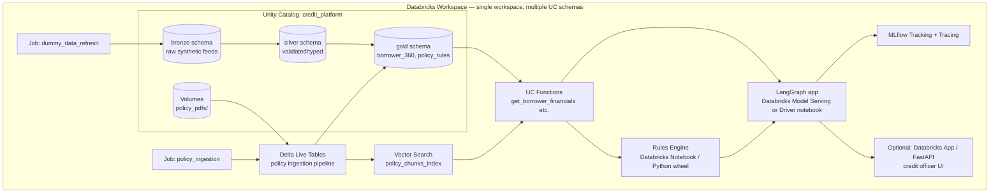
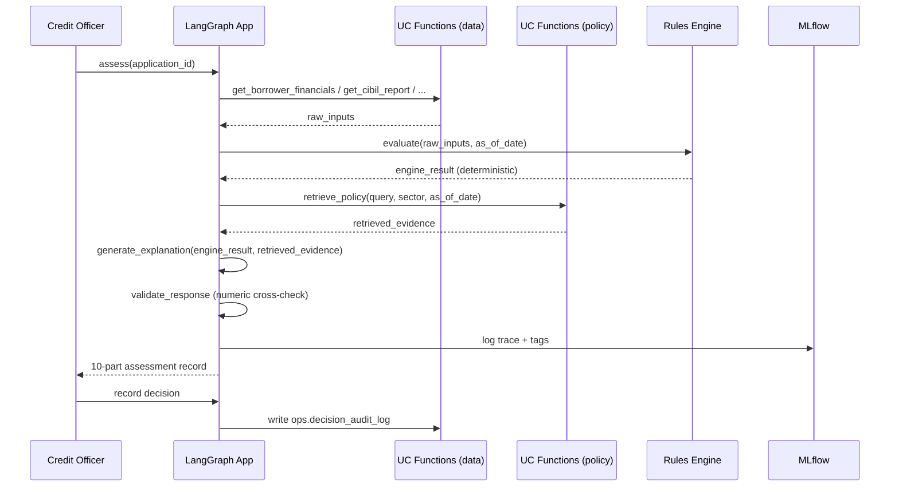

# Phased Implementation Plan & Low-Level Design
### Credit Decision Support & Policy Intelligence Platform — Databricks, Dummy Data

Companion to `Credit Decision Support & Policy Intelligence Platform.md` (business case + HLD). This document turns Section 13's roadmap into an executable, phase-by-phase build plan and adds the Low-Level Design that file stops short of.

**Ground rules for this build:**
1. **Databricks only** — Unity Catalog, Delta Lake, Vector Search, Model Serving, Jobs/DLT, MLflow. No external infra.
2. **Dummy data only** — every borrower, bureau, CRILC, and promoter record is synthetically generated. No real PII, no live API calls.
3. Architecture is designed once, at both HLD and LLD, before Phase 1 starts — phases implement against a fixed contract, not an evolving one.

---

## Part A — High-Level Architecture (recap + system boundary)

The HLD flow (data → policy intelligence → deterministic engine → LangGraph explanation → human review) is already defined in the main doc, Section 4. The one addition here is the **system boundary / deployment view**, which the main doc doesn't cover:



Everything lives inside one Databricks workspace and one Unity Catalog catalog (`credit_platform`). This keeps the project runnable on **Databricks Free Edition** with zero external dependencies — the constraint the original doc's tech stack (Section 10) already commits to.

---

## Part B — Phased Implementation Plan

Each phase has a fixed goal, dummy-data scope, deliverables, and an **exit criterion** — a concrete, testable condition that must be true before the next phase starts. Durations assume a solo/learning pace (part-time), not a team sprint.

### Phase 0 — Workspace & Repo Bootstrap (1–2 days)

| | |
|---|---|
| **Goal** | Databricks environment and repo scaffold exist and are reproducible from scratch |
| **Tasks** | Create Databricks Free Edition workspace; create catalog `credit_platform` with schemas `bronze`, `silver`, `gold`, `policy`, `ops`; create a Volume `credit_platform.policy.policy_pdfs`; set up Databricks Repos linked to a git repo with the folder structure in Part C; configure a personal cluster policy / serverless SQL warehouse |
| **Dummy data** | None yet — infra only |
| **Deliverable** | Empty but structured UC catalog; repo with folder skeleton; a "hello world" notebook that reads/writes one Delta table |
| **Exit criterion** | `SELECT * FROM credit_platform.bronze.<test_table>` runs from a notebook and from a SQL warehouse |

### Phase 1 — Foundation: Synthetic Data Layer (3–5 days)

Maps to Section 13, Phase 1 — expanded.

| | |
|---|---|
| **Goal** | All structured "ground truth" data the rules engine and agent will query exists as governed Delta tables |
| **Tasks** | Write a `Faker`-based generator notebook (`00_generate_dummy_data.py`) producing: borrowers, financial statements, CIBIL reports, CRILC/wilful-defaulter records, cross-bank exposure, promoter/guarantor records, internal product history (cards/OD/loans); load as bronze → validate/type → silver; build `gold.borrower_360` as a wide, query-ready view/table; define UC Functions (`get_borrower_financials`, `get_cibil_report`, `check_repeat_offender_signals`, `get_promoter_financials`) per the LLD table schemas in Part D |
| **Dummy data scope** | ~200 synthetic borrowers, weighted so ~70% "clean," ~15% borderline (SMA-1-like), ~10% delinquent/NPA, ~5% flagged repeat-offender; include the fixed reference borrower **Meera Textiles (MT-2026-0142)** exactly as specified in Section 3, so the demo scenario is reproducible on top of the random pool |
| **Deliverable** | Populated `bronze`/`silver`/`gold` schemas; 4 working UC Functions callable from SQL and Python; a data dictionary (table of column → meaning → source table) |
| **Exit criterion** | Given `MT-2026-0142`, `get_borrower_financials()` returns the exact values in Section 3's reference table |

### Phase 2 — Policy Intelligence Pipeline (4–6 days)

Maps to Section 13, Phase 2.

| | |
|---|---|
| **Goal** | Policy documents are parsed, versioned by effective date, chunked, embedded, and also distilled into a structured, machine-evaluable rules table |
| **Tasks** | Author 3–5 dummy policy documents as PDFs (general SME credit policy, textile-sector policy v1, textile-sector policy v2/revised circular, one unrelated-sector policy as a negative-retrieval control); land them in the `policy_pdfs` Volume with metadata sidecar files; build a DLT pipeline: `ai_parse_document` → metadata extraction (`doc_type`, `effective_date`, `supersedes`, `applicable_sector`, `approval_status`) → chunking → human-validated structured rule extraction; create `gold.policy_chunks` and `gold.policy_rules`; build the Vector Search index over `policy_chunks`; implement UC Function `retrieve_policy` |
| **Dummy data scope** | The pre/post-circular pair is mandatory: `POLICY-TEXTILE-01` (v1, effective 2026-01-01) and `POLICY-TEXTILE-01-v2` (effective 2026-09-01, supersedes v1, raises DSCR threshold) — this pair is what makes the Section 3 narrative hook work |
| **Deliverable** | Working `retrieve_policy(query, sector, as_of_date)` that returns only the version effective as of `as_of_date`; `policy_rules` table with the DSCR-001-style structured rules |
| **Exit criterion** | `retrieve_policy("DSCR threshold textile", as_of="2026-08-01")` returns v1; same call with `as_of="2026-09-15"` returns v2, and never both |

### Phase 3 — Deterministic Rules Engine (3–5 days)

Maps to Section 13, Phase 3.

| | |
|---|---|
| **Goal** | A pure Python/PySpark engine that takes an application + resolved policy version and deterministically returns eligibility — no LLM in this phase at all |
| **Tasks** | Implement `RuleLoader`, `MetricCalculator`, `PolicyEvaluator`, `ResultBuilder` (see LLD Part D); wire inputs from Phase 1 UC Functions and policy version from Phase 2's `policy_rules`; write the golden test set (Section 11's 10 cases) as parametrized unit tests |
| **Dummy data scope** | Reuse Phase 1 pool; add specifically-constructed edge-case applications for each of the 10 golden cases (e.g., a synthetic application with `dscr=1.15` against `POLICY-TEXTILE-01-v2` to force `manual_review`) |
| **Deliverable** | Installable engine (notebook-based or a small wheel) producing the exact JSON output shape in Section 7; passing golden test suite |
| **Exit criterion** | All 10 golden cases pass with a **deterministic, reproducible** status (same input → same output across repeated runs) |

### Phase 4 — Agent / Orchestration Layer (4–6 days)

Maps to Section 13, Phase 4.

| | |
|---|---|
| **Goal** | LangGraph state workflow that retrieves evidence and explains the engine's result — never recalculates it |
| **Tasks** | Implement the state graph from Section 6 as LangGraph nodes; wrap each UC Function as a LangChain tool; write the synthesis prompt producing the 10-part output (Section 9); implement `ValidateResponse` as a numeric cross-check (every number in the LLM's explanation must match a value already present in `RESULT` or retrieved evidence — reject and loop back to `GenerateExplanation` on mismatch) |
| **Dummy data scope** | No new data — this phase consumes Phase 1–3 outputs |
| **Deliverable** | Running graph, invocable end-to-end with just `application_id`; produces the full 10-part assessment record |
| **Exit criterion** | For MT-2026-0142, the agent's `Assessment Outcome` and `Key Risk Factors` sections cite only numbers traceable to `RESULT` or a retrieved policy chunk — zero invented figures across 10 sample runs |

### Phase 5 — Demo, Evaluation & Observability (3–4 days)

Maps to Section 13, Phase 5.

| | |
|---|---|
| **Goal** | The pre/post-circular demo runs live, everything is traced, and the golden set has a pass/fail report |
| **Tasks** | Wire MLflow Tracing across every LangGraph node and the rules engine call; build the pre/post-circular demo notebook (same question, run before and after ingesting policy v2); run the full golden set through the agent (not just the engine) and record retrieval/faithfulness/groundedness metrics per Section 11; optionally stand up a thin FastAPI or Databricks App front-end for the credit officer review step |
| **Dummy data scope** | None new |
| **Deliverable** | MLflow experiment with traced runs; a recorded before/after comparison matching Section 9's two demo outputs; an evaluation report against Section 11's metrics table |
| **Exit criterion** | Demo notebook reproduces Section 9's exact before/after outcome change (`Eligible` → `Conditional`) end-to-end without manual intervention |

### Phase 6 — Hardening & Stretch (optional, open-ended)

Only pursue after Phase 5 is solid. Candidates, in priority order: role-based access control on `policy_rules` writes, a real case-management UI, scheduled circular-watching job, human-in-the-loop override logging into `ops.decision_audit_log`. These map directly to Section 12's "Where the platform grows from here" — treat them as backlog, not a committed phase.

---

## Part C — Repository Layout (LLD)

```
RAG-Project/
├── Credit Decision Support & Policy Intelligence Platform.md   # business case + HLD (existing)
├── Phased Implementation Plan & LLD.md                          # this file
├── data_generation/
│   └── 00_generate_dummy_data.py        # Faker-based synthetic data, writes bronze
├── pipelines/
│   ├── policy_ingestion_dlt.py          # DLT: PDF -> parsed -> chunked -> gold
│   └── data_refresh_job.py              # scheduled bronze->silver->gold refresh
├── engine/
│   ├── rule_loader.py
│   ├── metric_calculator.py
│   ├── policy_evaluator.py
│   ├── result_builder.py
│   └── tests/test_golden_cases.py
├── agent/
│   ├── state.py                         # LangGraph state schema
│   ├── nodes.py                         # one function per state in Section 6
│   ├── tools.py                         # LangChain wrappers over UC Functions
│   ├── graph.py                         # graph assembly
│   └── prompts/synthesis_prompt.md
├── serving/
│   └── app.py                           # optional FastAPI / Databricks App
└── notebooks/
    ├── 01_setup_unity_catalog.py
    ├── 02_demo_pre_post_circular.py
    └── 03_run_golden_set_eval.py
```

---

## Part D — Low-Level Design

### D.1 Unity Catalog structure

```
credit_platform (catalog)
├── bronze
│   ├── raw_borrowers
│   ├── raw_financial_statements
│   ├── raw_cibil_reports
│   ├── raw_crilc_records
│   ├── raw_internal_product_history
│   └── raw_promoter_records
├── silver
│   ├── borrowers
│   ├── financial_statements
│   ├── cibil_reports
│   ├── crilc_records
│   ├── internal_product_history
│   └── promoter_records
├── gold
│   ├── borrower_360            (wide table, one row per borrower_id)
│   ├── policy_chunks           (text + metadata, source for vector index)
│   ├── policy_rules            (structured, source for rules engine)
│   └── applications
├── policy
│   └── (Volume) policy_pdfs/{document_id}/{version}.pdf
└── ops
    ├── assessment_results      (engine output, append-only)
    ├── assessment_explanations (agent output, append-only)
    └── decision_audit_log      (human review + overrides)
```

### D.2 Core table schemas

**`gold.borrower_360`**

| Column | Type | Notes |
|---|---|---|
| borrower_id | STRING (PK) | e.g. `MT-2026-0142` |
| legal_name | STRING | |
| sector | STRING | e.g. `textile_msme` |
| annual_turnover | DECIMAL(18,2) | |
| dscr | DOUBLE | latest computed DSCR |
| days_past_due | INT | |
| existing_exposure | DECIMAL(18,2) | |
| collateral_value | DECIMAL(18,2) | |
| cibil_score | INT | nullable → drives `missing_information` |
| crilc_flag | BOOLEAN | |
| wilful_defaulter_flag | BOOLEAN | |
| no_internal_history | BOOLEAN | true for new-to-bank borrowers (Section 8.1) |
| owner_ids | ARRAY<STRING> | promoter/guarantor IDs |
| data_as_of | DATE | freshness field surfaced in output Section 9.2 |

**`gold.policy_rules`** — mirrors Section 5's example exactly:

| Column | Type |
|---|---|
| rule_id | STRING (PK) |
| metric | STRING |
| operator | STRING |
| threshold | DOUBLE |
| applicable_sector | STRING |
| effective_date | DATE |
| supersedes | STRING NULL |
| source_document_id | STRING |
| approval_status | STRING |

**`gold.policy_chunks`** (Vector Search source table)

| Column | Type |
|---|---|
| chunk_id | STRING (PK) |
| document_id | STRING |
| version | STRING |
| chunk_text | STRING |
| effective_date | DATE |
| supersedes | STRING NULL |
| applicable_sector | STRING |
| embedding | ARRAY<FLOAT> (managed by Vector Search) |

**`ops.assessment_results`** and **`ops.assessment_explanations`** persist the exact JSON shapes from Section 7 (engine) and Section 9 (agent) respectively, keyed by `application_id`, append-only, so re-running an old `application_id` never overwrites history — this is what makes the audit trail in Section 1 real rather than aspirational.

### D.3 UC Functions (contract between data layer and both the engine and the agent)

| Function | Signature | Backing table(s) |
|---|---|---|
| `get_borrower_financials` | `(borrower_id STRING, owner_ids ARRAY<STRING> DEFAULT NULL) -> STRUCT` | `gold.borrower_360` |
| `get_cibil_report` | `(pan STRING) -> STRUCT` | `silver.cibil_reports` |
| `check_repeat_offender_signals` | `(borrower_id STRING) -> STRUCT` | `silver.crilc_records`, `silver.internal_product_history` |
| `get_promoter_financials` | `(owner_ids ARRAY<STRING>) -> ARRAY<STRUCT>` | `silver.promoter_records` |
| `retrieve_policy` | `(query STRING, applicable_sector STRING, as_of_date DATE) -> ARRAY<STRUCT>` | `gold.policy_chunks` via Vector Search index, filtered by `effective_date <= as_of_date` and no non-null `supersedes` pointing forward |

All five are registered as Unity Catalog Functions so they are callable identically from SQL, from the rules engine (Python), and as LangChain tools in the agent — one implementation, three callers.

### D.4 Deterministic Rules Engine — module design

```
RuleLoader.load(sector, as_of_date) -> List[Rule]          # from gold.policy_rules
MetricCalculator.compute(application, borrower_360) -> Metrics   # dscr, ltv, exposure_ratio...
PolicyEvaluator.evaluate(metrics, rules) -> List[RuleResult]     # pass/fail per rule, no side effects
ResultBuilder.build(application, rule_results, missing_fields) -> AssessmentResult  # Section 7 JSON shape
```

Pure functions throughout — no network calls, no LLM calls, no randomness. `RuleLoader` is the *only* place `as_of_date` resolution logic lives, so the pre/post-circular behavior (Section 3's narrative hook) is implemented in exactly one function and is trivially unit-testable in isolation.

### D.5 LangGraph — state schema and node map

```python
class AssessmentState(TypedDict):
    application_id: str
    borrower_id: str
    raw_inputs: dict           # from UC Functions
    missing_fields: list[str]
    engine_result: dict        # Section 7 output — set once, never mutated after
    retrieved_evidence: list[dict]
    draft_explanation: str
    validation_errors: list[str]
    final_explanation: dict    # Section 9's 10-part record
```

Node-to-state-diagram mapping (Section 6 is authoritative for the flow; this is the implementation mapping):

| Node function | Reads | Writes | Notes |
|---|---|---|---|
| `identify_application` | `application_id` | `borrower_id` | lookup only |
| `retrieve_data` | `borrower_id` | `raw_inputs` | calls the 4 data UC Functions as tools |
| `validate_data` | `raw_inputs` | `missing_fields` | no tool calls, pure check |
| `flag_missing_data` | `missing_fields` | `raw_inputs` (annotated) | never fabricates a value |
| `resolve_policy` + `calculate_metrics` + `evaluate_policy_rules` | `raw_inputs` | `engine_result` | **calls the Phase-3 engine directly — not an LLM call** |
| `retrieve_evidence` | `engine_result`, `borrower_id` | `retrieved_evidence` | calls `retrieve_policy` tool |
| `generate_explanation` | `engine_result`, `retrieved_evidence` | `draft_explanation` | only LLM-generation step |
| `validate_response` | `draft_explanation`, `engine_result` | `validation_errors` | regex/numeric cross-check against `engine_result` — loops back to `generate_explanation` on failure, per Section 6 |
| `human_review` (terminal) | `final_explanation` | writes to `ops.decision_audit_log` | graph ends here |

This table is the concrete reason the "LLM never decides" claim in Section 1 holds structurally: `engine_result` is written exactly once, by a non-LLM node, and every downstream node either reads it or is rejected by `validate_response`.

### D.6 Observability — MLflow tracing spans

One MLflow run per `application_id` assessment, with nested spans: `retrieve_data` → `rules_engine` → `retrieve_evidence` → `generate_explanation` → `validate_response`. Tag every run with `policy_version` and `engine_result.eligibility_status` so the pre/post-circular demo is queryable directly from the MLflow UI (filter by `application_id = APP-001`, compare the two runs' `policy_version` tag).

### D.7 Sequence — one end-to-end assessment call



---

## Part E — Phase Summary Table

| Phase | Focus | Duration | Key exit test |
|---|---|---|---|
| 0 | Workspace + repo | 1–2 days | UC catalog reachable from notebook + SQL warehouse |
| 1 | Synthetic data layer | 3–5 days | `get_borrower_financials('MT-2026-0142')` matches Section 3 |
| 2 | Policy intelligence | 4–6 days | `retrieve_policy` version-switches correctly across the circular date |
| 3 | Deterministic engine | 3–5 days | All 10 golden cases pass, reproducibly |
| 4 | Agent/orchestration | 4–6 days | Zero invented figures across 10 sample explanations |
| 5 | Demo + observability | 3–4 days | Pre/post-circular demo reproduces Section 9's outcome flip |
| 6 | Hardening (optional) | open | Backlog only, per Section 12 |

**Total core build (Phases 0–5): ~3–4 weeks at a part-time, solo pace.**
